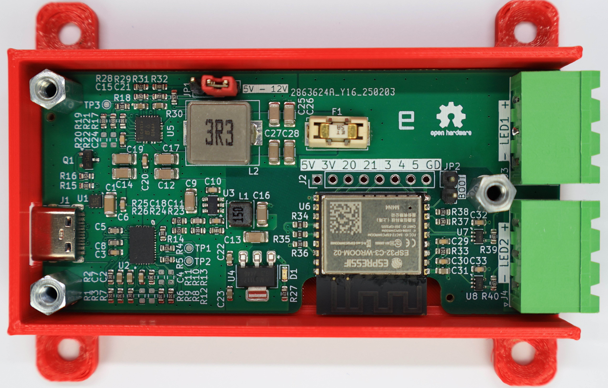
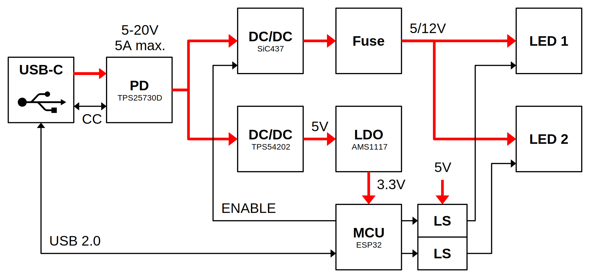
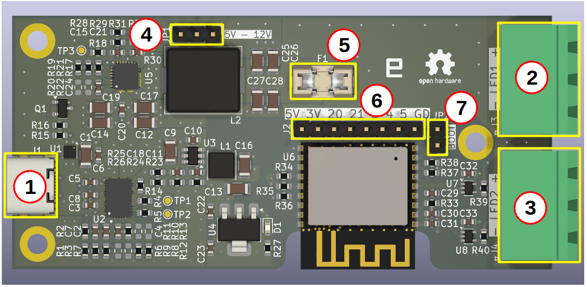

# WLED Controller

**WLED Controller** is a compact, **single-sided PCB** designed to run WLED firmware and control **two addressable LED strips**. It is powered entirely via **USB-C Power-Delivery** and supports either **5V or 12V** LED strips, with a maximum power of **60W**. Compatible with popular LED types such as **WS2812B** (5V) and **WS2815** (12V). It offers a clean, efficient solution for custom lighting projects.

## Block diagram

The entire board is powered via the USB-C connector. Voltage and current levels are negotiated through the TPS25730D USB Power Delivery (PD) controller, based on onboard configuration resistors. The supported input range is 5–20 V and 0.5–5 A, and the controller always negotiates the highest available voltage profile supported by the connected power adapter. These voltage/current profiles can be customized by soldering different resistor values.

There are two power paths:

1. **LED Power Path**: supplies power to the LED strips. The input voltage is stepped down by a SiC437 buck converter, providing high-efficiency regulation tailored to the selected LED voltage (5 V or 12 V). This path is protected by a fuse.

2. **Logic Power Path**: supplies power to the ESP32 and other low-power components. This path uses a TPS54202 buck converter to generate a stable 5 V rail, which is further regulated down to 3.3 V using an AMS1117 low-dropout (LDO) regulator.

A dedicated ENABLE signal from the ESP32 is used to control the LED power converter (SiC437). When LEDs are turned off in WLED, this signal disables the converter entirely - removing the need for additional output relays or transistors typically used to disconnect LED power.

The USB-C connector also provides a direct connection to the ESP32 via the USB 2.0, allowing firmware flashing and debug access without additional interfaces.

## PCB description

1. **USB-C connector.** Used for flashing the WLED firmware onto the ESP32 and for powering the entire board—including connected LED strips—via the USB Power Delivery (PD) protocol. Ensure you use a high-quality USB-C cable capable of handling the required current.
2. **LED output 1.** Connector for the first LED strip, providing power (+/-) and data signals.
3. **LED output 2.** Connector for the second LED strip, providing power (+/-) and data signals.
4. **LED voltage selector.** This 3-pin jumper is used to select the output voltage for the connected LED strips - either 5V or 12V. Always short the center pin with either the 5V or 12V pin, depending on your required LED strip voltage. Be careful, if no jumper is installed, the output voltage will be extremely low (close to 0V), and the LED strips will not function properly.
5. **Protection fuse.** Protects the board from short circuits or faults originating from the connected LED strips.
6. **GPIOs.** These exposed GPIO pins can be configured in WLED to support a variety of additional functions beyond basic LED control, including buttons, I2S microphone, IR receiver etc. Pin description:
    1. +5V
    2. +3.3V
    3. GPIO20
    4. GPIO21
    5. GPIO3
    6. GPIO4
    7. GPIO5
    8. GND
7. **Boot jumper.** Used to place the ESP32 into bootloader mode for firmware flashing.

## Bring-up guide

Follow these steps to flash the WLED firmware and configure the board:

1. Set the LED voltage jumper (5 V or 12 V) according to your connected LED strips.
2. Place a jumper on the BOOT connector to put the ESP32 into bootloader mode.
3. Connect the board to your PC using a USB-C cable.
4. Once connected, remove the BOOT jumper.
5. Install the WLED firmware following the official instructions: [kno.wled.ge](https://kno.wled.ge/basics/
6. Configure WLED as follows (see LED Preferences settings category in the web UI):
    1. **LED1 Data GPIO**: 7
    2. **LED2 Data GPIO**: 6
    3. **Relay GPIO**: 10 (no invert, no open drain)
7. Disconnect the USB from your PC and connect a suitable power adapter via USB-C.
8. Setup complete - the board is ready to use.

## Thermal consideration

If you power a long LED strip with relatively high power consumption, it may be necessary to provide heat dissipation for the controller - for example, using an aluminum case or a case with a fan. Most of the heat is dissipated by the SiC437 buck converter.

## Input power source type

The controller was tested with a standard USB power brick used for phone charging with USB Power Delivery capability. However, it should also work with other USB-C devices that support Power Delivery in source mode - for example, power banks, monitors, laptops, and similar devices. If you plan to power the controller from such a source, ensure that it supports the required USB PD power profile.

## License

[CERN Open Hardware Licence Version 2 - Permissive](https://cern-ohl.web.cern.ch/home)
